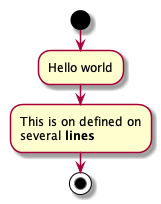

= Asciidoctor tips

== Docs and other usefull links

* https://asciidoctor.org/docs[AsciiDoc Docs]
* https://asciidoctor.org/docs/asciidoc-syntax-quick-reference/[AsciiDoc Syntax Quick Reference]

=== Helpfull extensions

==== PlantUml

Simple 

== Tools & editing

=== MS Visual Code

Using the common https://marketplace.visualstudio.com/items?itemName=joaompinto.asciidoctor-vscode[AsciiDoc plugin], installed over the extension manager to get good syntax highlighting and build in pdf generation. 

Helpfull commands

* Open Preview to the Side - ctrl+k v (Mac: cmd+k v)
* Open the command palette - ctrl+shift+p or F1 (Mac: cmd+shift+p)
-> Select AsciiDoc: Export document as PDF

== PlantUml

http://plantuml.com[PlantUML] is simple extension, to describe simple technical diagramms in ascii that can be generated to diagram pictures. 

PlantUml can be used as standalone files. 

.Example standalon .puml file
[source]
....
include::plantuml-simple.puml[]
....

.Output of plantuml-simple.puml

Or inside a asciidoc document. 

.Example inside .adoc file
[source]
....
include::plantuml-simple.adoc[]
....