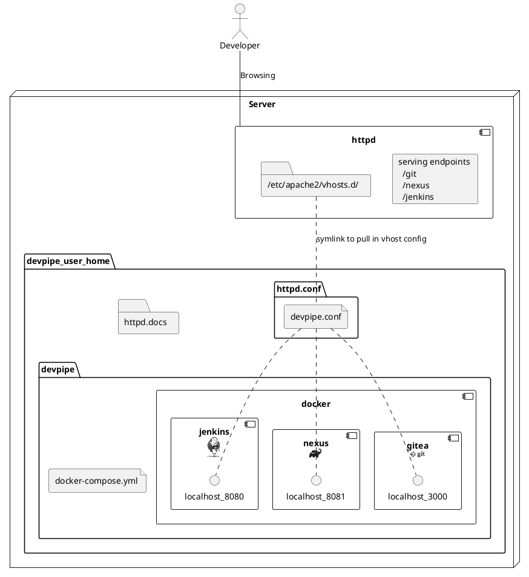

# Deployment sample

* see [deployment diagramm](https://plantuml.com/de/deployment-diagram)

```plantuml
@startuml
!include <logos/jenkins>
!include <logos/git>
!include <logos/gradle>

actor Developer

node Server{
  folder devpipe_user_home{
    folder httpd.conf {
      file devpipe.conf
    }
    folder httpd.docs
    folder devpipe{
      file dockercompose [ 
        docker-compose.yml 
      ]
      component docker{
        component "jenkins\n<$jenkins,scale=0.4>" {
          interface localhost_8080 
        }
        component "nexus\n<$gradle,scale=0.4>" {
          interface localhost_8081
        }
        component "gitea\n<$git,scale=0.5>"{
          interface localhost_3000
        }
      }
    }
    devpipe.conf .. localhost_8080
    devpipe.conf .. localhost_8081
    devpipe.conf .. localhost_3000

  }
  component httpd{
    card httpd_notes[
      serving endpoints 
        /git
        /nexus
        /jenkins
    ]


    folder apache[
      /etc/apache2/vhosts.d/
    ]
  }
  apache .. devpipe.conf: symlink to pull in vhost config

}

Developer -- httpd: Browsing 
@enduml
```