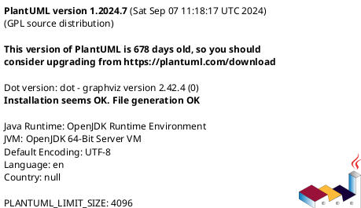
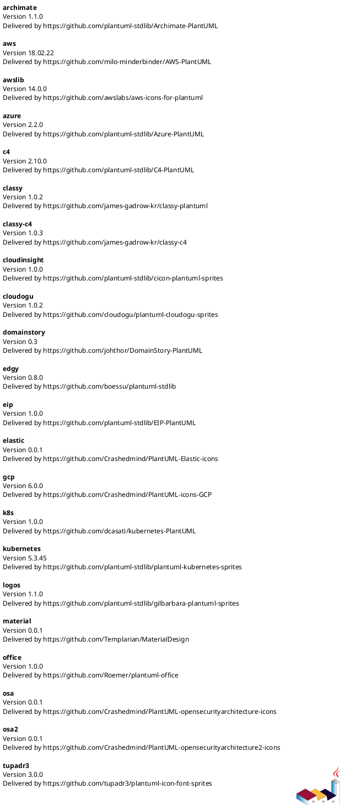
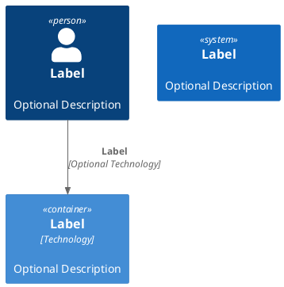
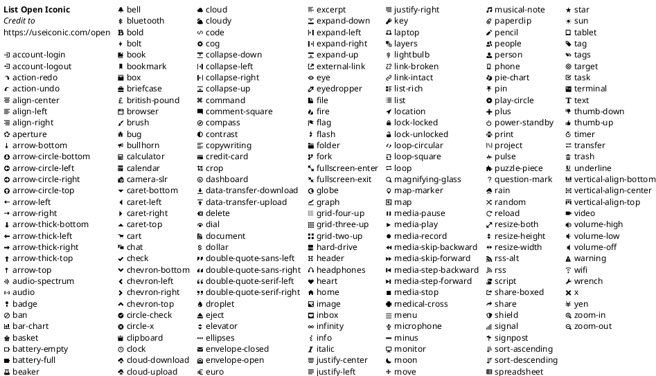

# PlantUML

* [PlantUML Homepage](https://plantuml.com/de/)


## Running local plantuml server

* running plantUML via [docker image](https://hub.docker.com/r/plantuml/plantuml-server)

```bash
docker run --name plantUML -d -p 8080:8080 plantuml/plantuml-server:latest
```

## simple example

```plantuml
Bob -> Alice : Hello
```

## overview stdlib

# icluded stdlib

* overview of inluded [stdlib](https://plantuml.com/de/stdlib), see also [platnuml-stdlib Github Repo](https://github.com/plantuml/plantuml-stdlib)





## simple C4 Components Diagram



## plantuml stdlib icons

